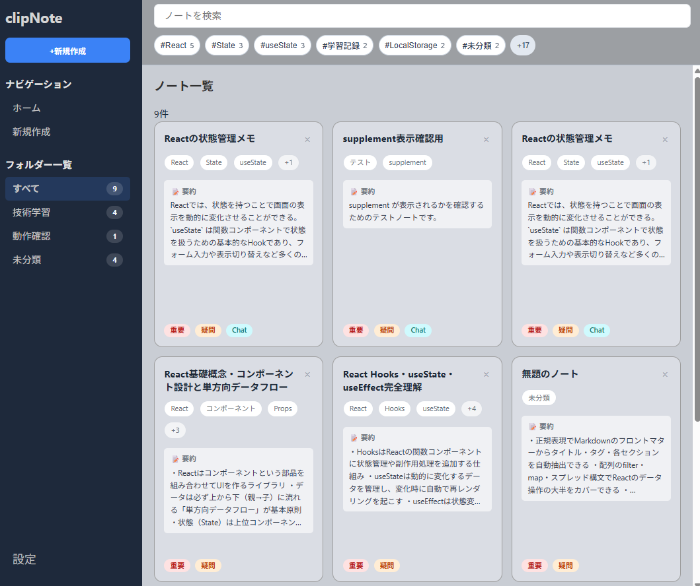
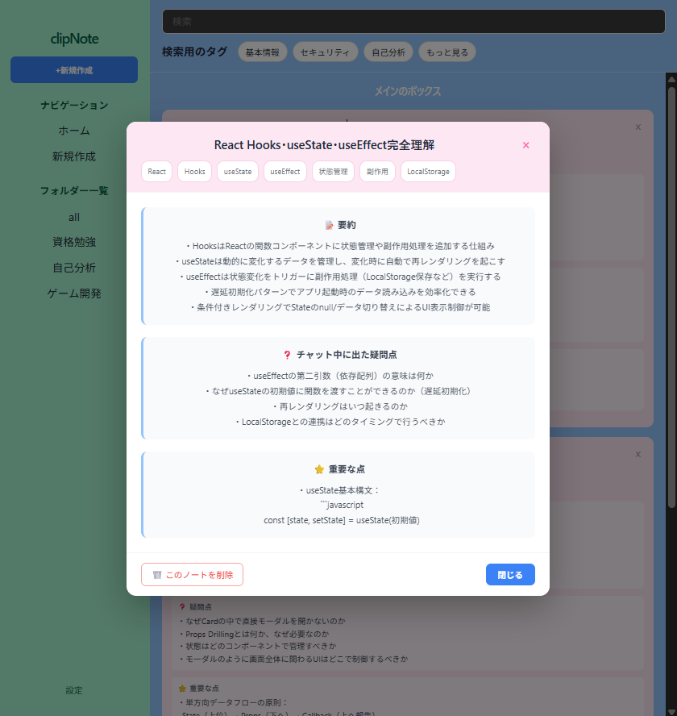
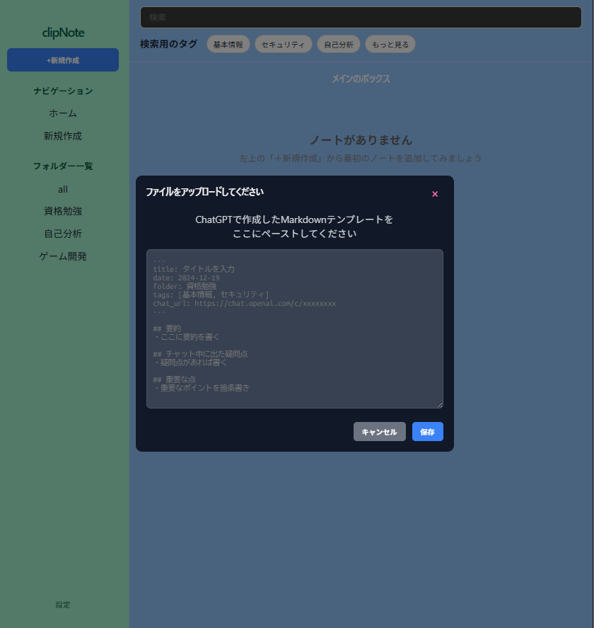
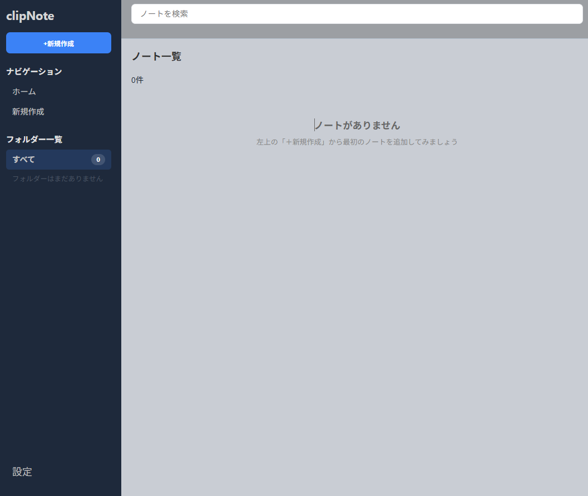

# ClipNote

Markdown形式のメモを、見返しやすいカード形式で管理できるノートアプリです。  
学習記録や技術メモを「あとから探しやすくすること」を目的に制作しました。

🔗 **Live Demo**  
https://clipnote-six.vercel.app

---

## 目次
- [アプリ概要](#アプリ概要)
- [画面イメージ](#画面イメージ)
- [主な機能](#主な機能)
- [入力イメージ](#入力イメージ)
- [制作背景](#制作背景)
- [工夫した点](#工夫した点)
- [使用技術](#使用技術)
- [セットアップ](#セットアップ)
- [今後の改善予定](#今後の改善予定)
- [制作者](#制作者)

---

## アプリ概要
プログラミング学習でMarkdownを使ってメモを取っていた中で、  
ファイル数が増えるほど「どこに何を書いたか分からない」という課題を感じました。

そこで、Markdownの内容から必要な情報を抽出し、  
**一覧で把握しやすく・詳細も見返しやすいノート管理アプリ**として ClipNote を制作しました。

Markdown形式のメモを、見返しやすいカード形式で管理できるノートアプリです。  
作成したノートはLocalStorageに保存され、設定機能からJSONでのバックアップ・復元にも対応しています。

---

## 画面イメージ

### 一覧画面

  

### 詳細モーダル

  

その他の画面を見る

### 新規作成モーダル

  

### 空状態

  

---

## 主な機能

- Markdownテンプレートを貼り付けてノートを作成
- front-matterからタイトル・タグなどを抽出
- 要約・疑問点・重要な点をカード形式で一覧表示
- ノート詳細をモーダルで確認
- ノートの削除
- LocalStorageによる自動保存
- 設定機能
  - JSONエクスポート
  - JSONインポート
  - 全ノート削除
- ノートがない場合の空状態メッセージ表示

---

## 入力イメージ
以下のようなMarkdownを貼り付けることで、タイトル・タグ・要約などを抽出し、ノートとして保存できます。

~~~md
---
title: Reactメモ
date: 2024-12-19
folder: 資格勉強
tags: [基本情報, セキュリティ]
---

## 要約
Reactの状態管理について整理した。

## チャット中に出た疑問点
useEffectを使うべき場面はどこか。

## 重要な点
状態更新は非同期で行われる。
~~~

---

## 制作背景
学習メモをMarkdownで蓄積していく中で、  
内容の振り返りに時間がかかることが課題でした。

特に、
- タイトルだけでは内容を思い出しにくい
- メモを開かないと要点が分からない
- 保存先が分散すると見返しにくい

といった不便さがあったため、  
**要約・疑問点・重要事項を一覧と詳細で見やすくする**ことを意識して制作しました。

---

## 工夫した点

### 1. Markdownから必要な情報を抽出
front-matterからタイトルやタグを取り出し、本文から「要約」「疑問点」「重要な点」を抽出してカード表示できるようにしました。

### 2. LocalStorageで保存し、再読み込み後も保持
作成したノートはLocalStorageに保存し、ページを再読み込みしても内容が消えないようにしています。

### 3. 設定機能でバックアップと復元に対応
LocalStorageはブラウザ依存のため、データ消失や端末移行のしづらさが課題になると考えました。  
そのため、設定機能として以下を実装しました。

- ノートのJSONエクスポート
- JSONファイルからのインポート
- 保存済みノートの全削除

インポート時は、読み込んだデータをそのまま追加するのではなく、現在のノート一覧をインポート内容で置き換える仕様にしています。  
また、`title` や `folder`、`tags` など不足している項目がある場合は、デフォルト値を補完して表示が崩れないようにしています。

### 4. 空状態の案内表示
初回利用時に操作へ迷わないよう、ノートが0件のときは「新規作成を促すメッセージ」を表示するようにしました。

### 5. デプロイ時の不具合を通して学んだこと
Vercelへデプロイした際、初回アクセス時に画面が正しく表示されない不具合が発生しました。  
ローカル環境では見えにくい問題でも、本番環境では初期状態の考慮が重要であることを学びました。

---

## 使用技術
- React
- Vite
- JavaScript / JSX
- TypeScript（一部導入）
- CSS
- LocalStorage
- Vercel

---

## セットアップ

~~~bash
git clone https://github.com/fumiaki10/clipnote.git
cd clipnote
npm install
npm run dev
~~~

ブラウザで `http://localhost:5173` にアクセスしてください。

---

## 今後の改善予定
- 検索機能の実装
- タグによる絞り込み機能
- フォルダー管理の実装
- Markdownプレビューの強化
- モバイル表示の改善
- 編集機能の追加

---

## 制作者
エンジニア就職活動を進めながら、  
「自分が実際に使いたいものを作る」ことを大切に制作しています。

今後は、アプリ制作・デザイン・表現活動を組み合わせながら、  
使いやすさと楽しさの両方を持ったものづくりを目指しています。
