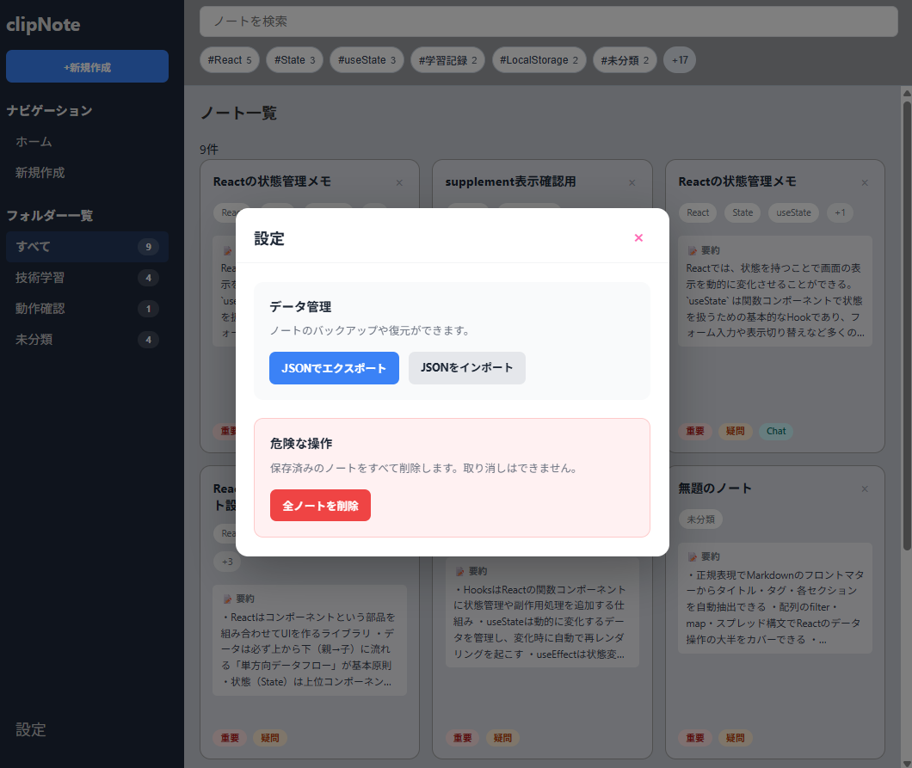

# ClipNote

Markdown形式の学習メモを、あとから見返しやすいカード形式で管理できるノートアプリです。  
メモの保存だけでなく、**一覧で把握しやすく・詳細で振り返りやすいこと**を意識して制作しました。

🔗 **Live Demo**  
https://clipnote-six.vercel.app

---

## 目次
- [アプリ概要](#アプリ概要)
- [画面イメージ](#画面イメージ)
- [主な機能](#主な機能)
- [入力イメージ](#入力イメージ)
- [制作背景](#制作背景)
- [工夫した点](#工夫した点)
- [使用技術](#使用技術)
- [セットアップ](#セットアップ)
- [今後の改善予定](#今後の改善予定)
- [制作者](#制作者)

---

## アプリ概要
プログラミング学習でMarkdownを使ってメモを取っていた中で、  
ファイル数が増えるほど「どこに何を書いたか分からない」「開かないと要点が分からない」という課題を感じました。

そこで ClipNote では、Markdownの内容から必要な情報を抽出し、  
**一覧ではすばやく内容を把握し、詳細モーダルでは必要な情報をしっかり確認できる**構成を目指しました。

作成したノートはLocalStorageに保存され、  
設定機能からJSONによるバックアップ・復元にも対応しています。

---

## 画面イメージ

### 一覧画面

  

### 詳細モーダル

  

その他の画面を見る

### 新規作成モーダル

  

### 空状態

  

### 設定モーダル

  

---

## 主な機能

- Markdownテンプレートを貼り付けてノートを作成
- front-matterからタイトル・日付・フォルダー・タグ・URLを抽出
- 本文から「要約」「疑問点」「重要な点」「補足」を抽出
- タイトル・要約・タグ・フォルダーを対象に検索
- タグ絞り込み
- フォルダー絞り込み
- ヘッダーに頻出タグを表示し、残りは `+n` で集約
- ノート詳細をモーダルで表示
- ノート削除
- LocalStorageによる自動保存
- 設定機能
  - JSONファイルのインポート
  - ノートデータのエクスポート
  - 保存済みノートの全削除
- ノートがない場合の空状態メッセージ表示

---

## 入力イメージ
以下のようなMarkdownを貼り付けることで、タイトル・タグ・要約などを抽出し、ノートとして保存できます。

~~~md
---
title: Reactメモ
date: 2026-06-29
folder: 技術学習
tags: [React, useState, 学習記録]
chat_url: https://example.com/chat/react-state
---

## 要約
Reactの状態管理について整理した。

## チャット中に出た疑問点
useEffectを使うべき場面はどこか。

## 重要な点
状態更新は非同期で行われる。

## 補足
実際にTodoアプリを作りながら、stateの流れを再確認したい。
~~~

---

## 制作背景
学習メモをMarkdownで蓄積していく中で、  
内容の振り返りに時間がかかることが課題でした。

特に、
- タイトルだけでは内容を思い出しにくい
- メモを開かないと要点が分からない
- 保存先が分散すると見返しにくい

といった不便さがあったため、  
**要約・疑問点・重要事項を一覧と詳細で見やすくする**ことを意識して制作しました。

---

## 工夫した点

### 1. Markdownから必要な情報だけを抽出して一覧化
front-matterからタイトル・日付・フォルダー・タグ・URLを取得し、本文から「要約」「疑問点」「重要な点」「補足」を抽出しています。  
Markdownをそのまま表示するのではなく、**見返すときに必要な単位へ整理して表示すること**を重視しました。

### 2. 一覧と詳細で役割を分け、情報量を整理
一覧カードではタイトル・タグ・要約・補助チップを中心に表示し、  
日付やフォルダー、URL、補足本文などは詳細モーダル側で確認できるようにしました。

情報を一画面に詰め込みすぎず、  
**一覧は把握しやすさ、詳細は確認しやすさ**を優先してUIを整理しています。

### 3. タグを上位表示 + `+n` でまとめ、ヘッダーの情報量を抑制
タグが増えたときにすべてを並べると見づらくなるため、  
ヘッダーには頻出タグのみを表示し、残りは `+n` で集約するようにしました。

これにより、よく使うタグで素早く絞り込みつつ、  
ヘッダー全体の情報量が増えすぎないようにしています。

### 4. LocalStorageの弱点を補う設定機能を実装
作成したノートはLocalStorageに保存され、再読み込み後も保持されます。  
一方で、LocalStorageはブラウザ依存であり、データ消失や端末移行のしづらさが課題になります。

そのため、設定機能として以下を実装しました。

- ノートのJSONエクスポート
- JSONファイルからのインポート
- 保存済みノートの全削除

また、インポート時は現在のノート一覧を読み込んだ内容で置き換える仕様にし、  
`title`・`folder`・`tags`・`supplement` などの不足項目にはデフォルト値を補完して表示崩れを防いでいます。

### 5. 空状態の案内表示で初回利用時の迷いを減らした
初回利用時に操作へ迷わないよう、ノートが0件のときは  
新規作成を促すメッセージを表示するようにしました。  
機能がない状態でも、次に何をすればよいか分かることを意識しています。

### 6. 実装トラブルを通して、状態管理とUI反映の理解を深めた
タグ絞り込みやヘッダーの挙動を整える中で、  
「クリックで直接見た目が変わる」のではなく、  
**stateの更新 → 再描画 → UI反映** というReactの基本的な流れを実践の中で理解しました。

また、propsの受け渡しや絞り込み条件の統一など、  
小さなズレが不具合につながることも学びました。

---

## 使用技術
- React
- Vite
- JavaScript / JSX
- CSS
- LocalStorage
- Vercel

---

## セットアップ

~~~bash
git clone https://github.com/fumiaki10/clipnote.git
cd clipnote
npm install
npm run dev
~~~

ブラウザで `http://localhost:5173` にアクセスしてください。

---

## 今後の改善予定
- ノート編集機能の追加
- モバイル表示の改善
- Markdownプレビューの強化
- タグ表示の拡張（`+n` からの展開や「もっと見る」）
- 永続化方式の拡張（将来的なAPI / DB化）

---

## 制作者
エンジニア就職活動を進めながら、  
「自分が実際に使いたいものを作る」ことを大切に制作しています。

今後は、アプリ制作・デザイン・表現活動を組み合わせながら、  
使いやすさと楽しさの両方を持ったものづくりを目指しています。
